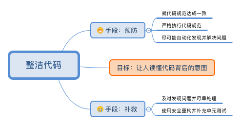
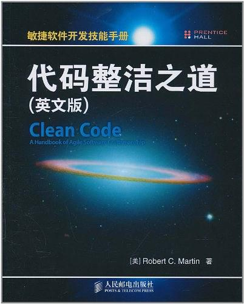
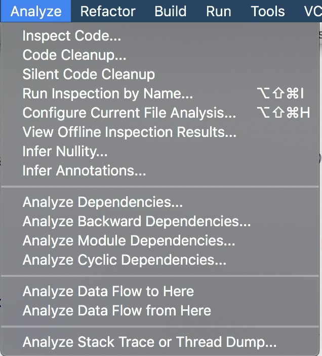
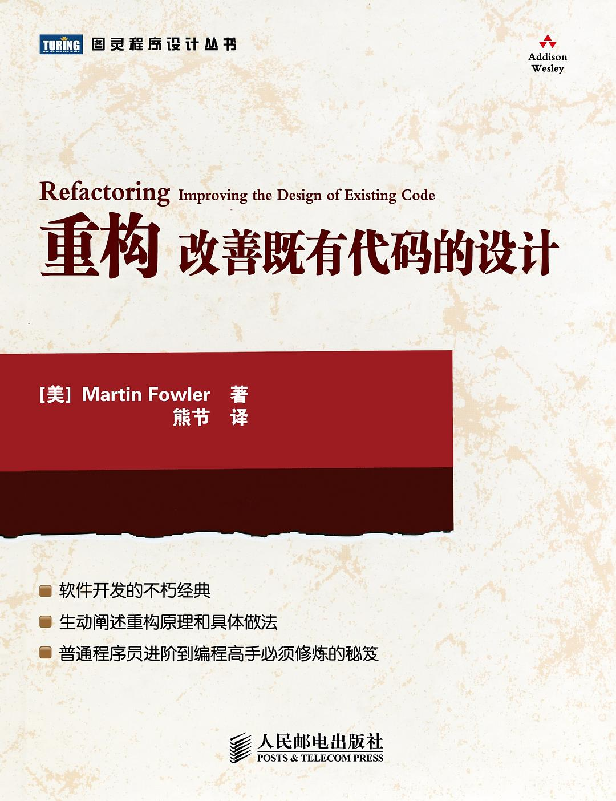
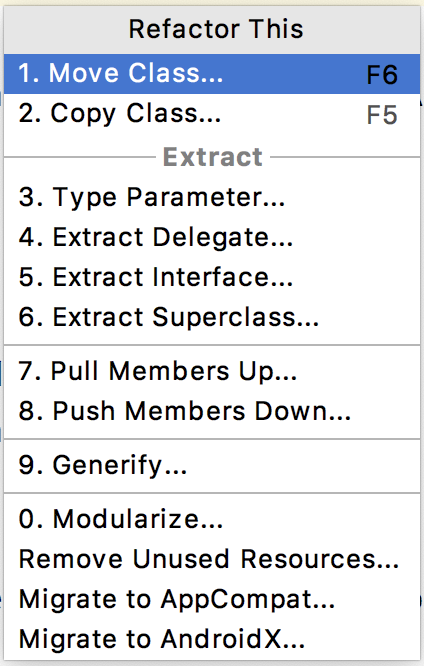

<!-- _class: invert -->

# <!-- fit -->**整洁代码&重构基础**

CAC@OPPO by 黄俊彬 & 覃宇

---
<!-- _class: lead -->



---

<!-- _class: lead -->






---

# :speech_balloon: 大家说...

1. 方法太长，类太大
2. 命名太南了
3. if/else/for嵌套太深
4. 注释和文档问题
5. 滥用设计模式
6. 匿名内部类和回调地狱
7. 并发和多线程问题

---

<!-- _class: invert -->

# <!-- fit --> **方法太长，类太大**

* 代码冗余/重复，不是最优实现
* 不敢删除遗留代码，怕出问题
* 复制粘贴造成的帝王类
* 类职责太多(违反 SRP)
* 业务逻辑放在了 UI 中

---

# <!-- fit --> :question:过长方法和过大类曾经给你带来什么困扰？通过什么方式解决？
（讨论时间：5分钟）

---

## 坏味道在哪:question:

<!-- 函数如果有多个抽象级别时，说明通常做了太多事情。拆分函数将会提升重用性和可测试性。-->

``` java
void parseBetterJSAlternative(String code) {
    String[] REGECES = {};
    String[] statements = code.split(" ");
    String[] tokens = {};
    for(String regex: Arrays.asList(REGECES)) {
        for(String statement:Arrays.asList(statements)) { //... }
    }

    String[] ast={};
    for(String token:Arrays.asList(tokens)) { //lex ...}

    for(String node:Arrays.asList(ast)) { //parse ...}
}
```

---

## 坏味道：方法抽象超过一层。补救办法：提取方法

``` java
String[] tokenize(String code) {
    String[] REGECES = {};
    String[] statements = code.split(" ");
    String[] tokens = {};
    for(String regex: Arrays.asList(REGECES)) {
        for(String statement:Arrays.asList(statements)) { //tokens push }
    }
    return tokens;
}

String[] lexer(String[] tokens) {
    String[] ast = {};
    for(String token:Arrays.asList(tokens)) { //ast push }
    return ast;
}

void parseBetterJSAlternative(String code) {
    String[] tokens = tokenize(code);
    String[] ast = lexer(tokens);
    for(String node:Arrays.asList(ast)) { //parse ...}
}
```

---

## 坏味道在哪:question:

``` java
void showDeveloperList(List<Developer> developers) {
    for(Developer developer:developers) {
        render(new Data(developer.expectedSalary, developer.experience, developer.githubLink));
    }
}

void showManagerList(List<Manager> managers) {
    for(Manager manager:managers) {
        render(new Data(manager.expectedSalary, manager.experience, manager.portfolio));
    }
}
```

---

## 坏味道：重复代码。补救办法：消除重复

<!-- 竭尽你的全力去避免冗余代码。 冗余代码是不好的， 因为它意味着当你需要修改一些逻辑时会有多个地方需要修改。

想象一下你在经营一家餐馆，你需要记录所有的库存西红柿， 洋葱， 大蒜， 各种香料等等。如果你有多个记录列表，当你用西红柿做一道菜时你得更新多个列表。 如果你只有一个列表， 就只有一个地方需要更新！

你有冗余代码通常是因为你有两个或多个稍微不同的东西， 它们共享大部分， 但是它们的不同之处迫使你使用两个或更多独立的函数来处理大部分相同的东西。 移除冗余代码意味着创建一个可以处理这些不同之处的抽象的函数/模块/类。

让这个抽象正确是关键的， 这是为什么要你遵循 *Classes* 那一章的 SOLID 的原因。 不好的抽象比冗余代码更差， 所以要谨慎行事。 既然已经这么说了， 如果你能够做出一个好的抽象， 才去做。 不要重复你自己， 否则你会发现当你要修改一个东西时时刻需要修改多个地方。 -->

``` java
void showList(List<Employee> employees) {
    for(Employee employee:employees) {
        Data data=new Data(employee.expectedSalary,employee.experience,employee.githubLink);
        String portfolio=employee.portfolio;
        if("manager".equals(employee)){
            portfolio=employee.portfolio;
        }
        data.portfolio=portfolio;
        render(data);
    }
}
```

---

## 坏味道在哪:question:

``` java
@Deprecated
void oldRequestModule(String url) {
    // ...
}

void newRequestModule(String url) {
    // ...
}

String req = newRequestModule;
inventoryTracker("apples", req, "www.inventory-awesome.io");
```

---

## 坏味道：僵尸代码。解救办法：安全删除

<!-- 僵死代码和冗余代码同样糟糕。 没有理由在代码库中保存它。 如果它不会被调用， 就删掉它。 当你需要它时， 它依然保存在版本历史记录中。 -->

``` java
void newRequestModule(String url) {
    // ...
}

String req = newRequestModule;
inventoryTracker("apples", req, "www.inventory-awesome.io");
```

---

## 坏味道在哪:question:

<!-- 正如代码整洁之道所述， “永远不要有超过一个理由来修改一个类”。 给一个类塞满许多功能， 就像你在航班上只能带一个行李箱一样， 这样做的问题你的类不会有理想的内聚性， 将会有太多的理由来对它进行修改。最小化需要修改一个类的次数时很重要的， 因为如果一个类拥有太多的功能， 一旦你修改它的一小部分，将会很难弄清楚会对代码库中的其它模块造成什么影响。 -->

``` java
class UserSettings {
    User user;

    void changeSettings(UserSettings settings) {
        if (this.verifyCredentials()) {
            // ...
        }
    }

    void verifyCredentials() {
        // ...
    }
}
```

---

## 坏味道：违反单一职责原则。补救办法：提取类、移动方法

``` java
User user;
UserAuth auth;

public UserSettings(User user) {
    this.user = user;
    this.auth = new UserAuth(user);
}

void changeSettings(UserSettings settings) {
    if (this.auth.verifyCredentials()) {
        // ...
    }
}
```

---

## 预防措施

### 代码规范

* 方法长度限制
* 类长度限制
* 接口废弃约定（@Deprecated）

### CheckStyle

* Maximum File Length（最大文件长度）
* Maximum Line Length（最大行长度）
* Maximum Method Length（最大方法长度）
* Strict Duplicate Code（严格重复代码）
* Designed For Extension（设计扩展性）

---

## 重构手法

* 提取方法（Extract Method）
* 移动变量（Move...）
* 移动方法（Move...）
* 安全删除（Safe Delete）

---

<!-- _class: invert -->
# <!-- fit --> 命名太🀁了

* Chinglish，英文水平参差不齐
* 方法参数太多，命名随意，无法判断参数副作用
* 滥用缩写
* 实现修改了，命名没有修改
* 害怕散弹式修改，不敢重命名或者修改参数

---

# <!-- fit --> :question:你是否为曾经为命一个好名称而感到头痛，你有什么好的方式解决？
（讨论时间：5分钟）

---

## 坏味道在哪:question:

``` java
String yyyymmdstr = new SimpleDateFormat("YYYY/MM/DD").format(new Date());
```

---

## 坏味道：命名无意义。补救办法：使用有意义并且可读的变量名称

``` java
String currentDate = new SimpleDateFormat("YYYY/MM/DD").format(new Date());
```

---

## 坏味道在哪:question:

<!-- 我们要阅读的代码比要写的代码多得多， 所以我们写出的代码的可读性和可搜索性是很重要的。使用没有意义的变量名将会导致我们的程序难于理解， 将会伤害我们的读者，所以请使用可搜索的变量名。 -->

``` java
// 86400000 是什么鬼？
setTimeout(blastOff, 86400000);
```

---

## 坏味道：魔法值。补救办法：使用可搜索的名称

``` java
// 将它们声明为全局常量。
public static final int MILLISECONDS_IN_A_DAY = 86400000;
setTimeout(blastOff, MILLISECONDS_IN_A_DAY);
```

---

## 坏味道在哪:question:

``` java
String address = "One Infinite Loop, Cupertino 95014";
String cityZipCodeRegex = "/^[^,\\\\]+[,\\\\\\s]+(.+?)\\s*(\\d{5})?$/";

saveCityZipCode(address.split(cityZipCodeRegex)[0],
address.split(cityZipCodeRegex)[1]);
```

--- 

## 坏味道：直接用表达式传递变量。补救办法：增加解释性变量

```java 
String address = "One Infinite Loop, Cupertino 95014"; 
String cityZipCodeRegex = "/^[^, \\\\]+[, \\\\\\s]+(.+?)\\s*(\\d{5})?$/"; 

String city = address.split(cityZipCodeRegex)[0]; 
String zipCode = address.split(cityZipCodeRegex)[1]; 

saveCityZipCode(city, zipCode); 

```

---

## 坏味道在哪:question:

```java
String[] l = {"Austin", "New York", "San Francisco"};

for (int i = 0; i < l.length; i++) {
    String li = l[i];
    doStuff();
    doSomeOtherStuff();
    // ...
    // ...
    // ...
    // Wait, what is `$li` for again?
    dispatch(li);
}
```

---

## 坏味道：使用隐晦的缩写。补救办法：使用显示命名

``` java
String[] locations = {"Austin", "New York", "San Francisco"};

for (String location : locations) {
    doStuff();
    doSomeOtherStuff();
    // ...
    // ...
    // ...
    dispatch(location);
}
```

---

## 坏味道在哪:question:

<!-- 限制函数参数的个数是非常重要的， 因为这样将使你的函数容易进行测试。 一旦超过三个参数将会导致组合爆炸，因为你不得不编写大量针对每个参数的测试用例。没有参数是最理想的，一个或者两个参数也是可以的， 三个参数应该避免， 超过三个应该被重构。 通常，如果你有一个超过两个函数的参数， 那就意味着你的函数尝试做太多的事情。 如果不是， 多数情况下一个更高级对象可能会满足需求。当你发现你自己需要大量的参数时， 你可以使用一个对象。 -->

``` java
void createMenu(String title, String body, String buttonText, boolean cancellable) {}
```

---


## 坏味道：超长参数列表（超过2个）。补救办法：封装参数对象

``` java
class MenuConfig {
    String title;
    String body;
    String buttonText;
    boolean cancellable;
}
void createMenu(@Nullable MenuConfig menuConfig) {}
```

---

## 预防措施

### 代码规范

* 常量使用（位置、命名）
* 使用标记注解（android.support.annotations）
* 建立业务术语表（中英文对照）

### CheckStyle

* Member Names（成员名称）
* Method Names（方法名称）
* Maximum Parameters（最大参数数量）

### 参考别人是怎么命名的 [https://unbug.github.io/codelf/]()
### 利用 Android Studio 提示参数名

--- 

## 重构手法

* 重命名（Rename）
* 提取常量（Extract Constant）
* 提取变量（Extract Variable）
* 提取方法参数对象（Extract Parameter）
* 修改方法签名（Change Signature）

---

<!-- _class: invert -->
# <!-- fit --> if/else/for嵌套

* 缩进不统一，怕影响 blame 不敢改
* 分支丢失，缺少 else

---

# <!-- fit --> :question:为什么 if-else 不是好代码？
（讨论时间：5分钟）

---

## 坏味道在哪:question:


``` java
if (fsm.state.equals("fetching") && listNode.isEmpty()) {
    //...
}
```

---

## 坏味道：条件语句过长。补救办法：封装条件语句

``` java
void shouldShowSpinner(Fsm fsm, String listNode) {
    return fsm.state.equals("fetching") && listNode.isEmpty();
}

if (shouldShowSpinner(fsmInstance, listNodeInstance)) {
    // ...
}
```

---

## 坏味道在哪:question:

``` java
void isDOMNodeNotPresent(Node node) {
    // ...
}

if (!isDOMNodeNotPresent(node)) {
    // ...
}
```

---

## 坏味道：负面条件判断语句。补救办法：使用正面判断条件

``` java
void isDOMNodePresent(Node node) {
    // ...
}

if (isDOMNodePresent(node)) {
    // ...
}
```

---

## 坏味道在哪:question:

``` java

double disablityAmount() {
    if (_seniority < 2) 
        return 0;

    if (_monthsDisabled > 12)
        return 0;

    if (_isPartTime)
        return 0;

    //do somethig
    }
```

---

## 坏味道：相同结果的条件过渡拆分。补救办法：合并条件表达式

``` java
double disablityAmount(){
    if (_seniority < 2 || _monthsDisabled > 12 || _isPartTime)
        return 0;
    //do somethig
}
```
<!-- 这段代码还有什么问题？ -->

---

## 坏味道在哪:question:

``` java
double getPayAmount() {
    double result;
    if (_isDead) {
        result = deadAmount();
    } else {
        if (_isSeparated) {
            result = separatedAmount();
        }
        else {
            if (_isRetired) {
                result = retiredAmount();
            else {
                result = normalPayAmount();
            }
        }
    }
    return result;
}
```

---

## 坏味道：if-else嵌套没有关联性。补救办法：将包含关系改为平行关系

``` java

double getPayAmount(){
    if (_isDead) 
        return deadAmount();
 
    if (_isSeparated)
        return separatedAmount();
 
    if (_isRetired)
        return retiredAmount();
 
    return normalPayAmount();
}
```

---

## 坏味道在哪:question:

``` java
/* 查找年龄大于18岁且为男性的学生列表 */
public ArrayList<Student> getStudents(int uid){
        ArrayList<Student> result = new ArrayList<Student>();
        Student stu = getStudentByUid(uid);
        if (stu != null) {
            Teacher teacher = stu.getTeacher();
            if (teacher != null) {
                ArrayList<Student> students = teacher.getStudents();
                if (students != null) {
                    for(Student student : students){
                        if(student.getAge() > = 18 && student.getGender() == MALE){
                            result.add(student);
                        }
                    }
                } else {
                    logger.error("获取学生列表失败");
                }
            } else {
                logger.error("获取老师信息失败");
            }
        } else {
            logger.error("获取学生信息失败");
        }
        return result;
    }
```

---

## 坏味道："箭头型"代码。补救办法：异常条件先退出，保持主干流程是核心流程

``` java
/* 查找年龄大于18岁且为男性的学生列表 */
public ArrayList<Student> getStudents(int uid){
        ArrayList<Student> result = new ArrayList<Student>();
        Student stu = getStudentByUid(uid);
        if (stu == null) {
            logger.error("获取学生信息失败");
            return result;
        }
 
        Teacher teacher = stu.getTeacher();
        if (teacher == null) {
            logger.error("获取老师信息失败");
            return result;
        }
 
        ArrayList<Student> students = teacher.getStudents();
        if (students == null) {
            logger.error("获取学生列表失败");
            return result;
        }
 
        for(Student student : students) {
            if (student.getAge() > 18 && student.getGender() == MALE){
                result.add(student);
            }
        }
        return result;
    }
```
<!-- 还可以进一步提升吗？ -->

---

## 坏味道在哪:question:

<!-- 这看起来似乎是一个不可能的任务。 第一次听到这个时， 多数人会说： “没有 `if` 语句还能期望我干啥呢”， 答案是多数情况下你可以使用多态来完成同样的任务。 第二个问题通常是 “好了， 那么做很棒，但是我为什么想要那样做呢”， 答案是我们学到的上一条代码整洁之道的理念： 一个函数应当只做一件事情。
当你有使用 `if` 语句的类/函数是， 你在告诉你的用户你的函数做了不止一件事情。 记住： 只做一件事情。 -->

``` java
class Airplane {
    int getCurisingAltitude() {
        switch(this.type) {
            case "777":
                return this.getMaxAltitude() - this.getPassengerCount();
            case "Air Force One":
                return this.getMaxAltitude();
            case "Cessna":
                return this.getMaxAltitude() - this.getFuelExpenditure();
        }
    }
}
```

---

## 坏味道：条件分支太多。补救办法：运用多态

``` java
class Airplane {
    // ...
}

class Boeing777 extends Airplane {
    // ...
    int getCruisingAltitude() {
        return this.getMaxAltitude() - this.getPassengerCount();
    }
}

class AirForceOne extends Airplane {
    // ...
    int getCruisingAltitude() {
        return this.getMaxAltitude();
    }
}

class Cessna extends Airplane {
    // ...
    int getCruisingAltitude() {
        return this.getMaxAltitude() - this.getFuelExpenditure();
    }
}
```

<!--这里是什么模式-->

---

## 预防措施

### 代码规范

* 统一缩进（使用 Space，利用保存时自动格式化功能）
* 限制方法复杂度（不超过 7）

### CheckStyle

* Nested For Depth（for嵌套深度）
* Nested If Depth（if嵌套深度）
* Simplify Boolean Expression（简化布尔表达式）
* Cyclomatic Complexity（圈复杂度）

### `git blame -w -M` 或者 [git-hyper-blame](https://commondatastorage.googleapis.com/chrome-infra-docs/flat/depot_tools/docs/html/git-hyper-blame.html)

---

## 重构手法

* 提取变量（Extract Variable）
* 提取方法（Extract Method）
* 移动代码块（Move...）

---

<!-- _class: invert -->
# <!-- fit --> 文档和注释问题

* 重要的方法没有注释，如关键算法、BUG 修改
* 无意义的注释太多
* 重要的接口缺少文档
* 接口文档没有集中管理，搜索如大海捞针

---

# <!-- fit --> :question:那些注释或文档是必需要写的？
（讨论时间：5分钟）

---

## 坏味道在哪里:question:

<!-- 注释是代码的辩解， 不是要求。 多数情况下， 好的代码就是文档。 -->

``` java
void hashIt(String data) {
    // The hash
    long hash = 0;

    // Length of string
    int length = data.length();

    // Loop through every character in data
    for (int i = 0; i < length; i++) {
        // Get character code.
        char mChar = data.charAt(i);
        // Make the hash
        hash = ((hash << 5) - hash) + mChar;
        // Convert to 32-bit integer
        hash &= hash;
    }
}
```

---

## 坏味道：无意义的注释太多。补救办法：仅对包含复杂业务逻辑进行注释

``` java
void hashIt(String data) {
    long hash = 0;
    int length = data.length();

     for (int i = 0; i < length; i++) {
         char mChar = data.charAt(i);
         hash = ((hash << 5) - hash) + mChar;

        // Convert to 32-bit integer
        hash &= hash;
    }
}
```

---

## 坏味道在哪里:question:

<!-- 因为有版本控制， 把旧的代码留在历史记录即可。 -->

``` java 

    doStuff();
    // doOtherStuff();
    // doSomeMoreStuff();
    // doSoMuchStuff();

``` 

---

## 坏味道：不要在代码库中保存注释掉的代码。补救办法：把老代码留在版本控制里面

```java
    doStuff();
```

---

## 坏味道在哪里:question:

<!-- 记住， 使用版本控制！ 不需要僵尸代码， 注释掉的代码， 尤其是日志式的注释。 使用 `git log` 来
获取历史记录。 -->

``` java
/**
 * 2016-12-20: Removed monads, didn't understand them (RM)
 * 2016-10-01: Improved using special monads (JP)
 * 2016-02-03: Removed type-checking (LI)
 * 2015-03-14: Added combine with type-checking (JR)
 */
void combine(String a, String b) {
    return a + b;
}
```

---

## 坏味道：不要有日志式的注释。补救办法：移除，使用 `git log` 来获取历史记录

``` java
void combine(String a, String b) {
    return a + b;
}
```

---

## 坏味道在哪里:question:

<!-- 它们仅仅添加了干扰，让函数和变量名称与合适的缩进和格式化为你的代码提供视觉结构。 -->

``` java
////////////////////////////////////////////////////////////////////////////////
// Scope Model Instantiation
////////////////////////////////////////////////////////////////////////////////
String[] model = {"foo","bar"};

////////////////////////////////////////////////////////////////////////////////
// Action setup
////////////////////////////////////////////////////////////////////////////////
void action(){
    //...
}
```

---

## 坏味道：使用占位符。补救办法：移除，使用缩进和格式化；有意义的命名

``` java
String[] model = {"foo", "bar"};
void actionSetup(){
    //...
}
```

---

## 预防措施

### 代码规范

* 公共接口必须规范注释（JavaDoc 规范）
* 复杂算法加上合适的注释
* 用有意义的名字代替注释

### CheckStyle

* Style Javadoc（风格注释）
* Trailing Comment（行尾注释）

---

<!-- _class: invert -->
# <!-- fit --> 滥用设计模式

* 单例模式初始化顺序引起 NPE
* 单例带来的内存问题，尤其使用 list 或者 map

--- 

# <!-- fit --> :question:在项目中，经常使用那些了那些设计模式，为什么使用？使用时有什么地方需要注意吗？
（讨论时间：5分钟）

---

## 坏味道在哪里:question:

<!-- 当调用getInstance时，如果传入的context是Activity的context。只要这个单例没有被释放，那么这个Activity也不会被释放一直到进程退出才会释放。 -->

``` java
public class CommUtil {
    private static CommUtil instance;
    private Context context;

    private CommUtil(Context context) {
        this.context = context;
    }

    public static CommUtil getInstance(Context mcontext) {
        if (instance == null) {
            instance = new CommUtil(mcontext);
        }
        return instance;
    }
}
```

---

## 坏味道：单例造成的内存泄漏。补救办法：绑定引用的生命周期或及时释放引用

<!-- 能使用Application的Context就不要使用Activity的Context，Application的生命周期伴随着整个进程的周期 -->

``` java
public class CommUtil {
    private static CommUtil instance;
    private Context context;

    private CommUtil(Context context) {
        this.context = context;
    }

    public static CommUtil getInstance(Context mcontext) {
        if (instance == null) {
            instance = new CommUtil(mcontext.getApplicationContext());
        }
        return instance;
    }
}
```

---

## 预防措施

### CheckStyle

* Explicit Initialization（显式初始化）
* Class Data Abstraction Coupling（类的数据抽象耦合）

### leakcanary

* debug notify

### 依赖注入

* dagger2
* koin

---

<!-- _class: invert -->
# <!-- fit --> 匿名内部类和回调地狱

* 随意使用匿名内部类
* 回调地狱，可读性极差

---

# <!-- fit --> :question:为什么会“偷懒”使用匿名内部类？
（讨论时间：5分钟）

---

## 坏味道在哪里:question:

<!-- 
异步任务和Runnable都是一个匿名内部类，因此它们对当前Activity都有一个隐式引用。如果Activity在销毁之前，任务还未完成， 那么将导致Activity的内存资源无法回收，造成内存泄漏 -->

``` java
new AsyncTask<Void, Void, Void>() {
    @Override
    protected Void doInBackground(Void... params) {
        SystemClock.sleep(10000);
        return null;
    }
}.execute();

new Thread(new Runnable() {
    @Override
    public void run() {
        SystemClock.sleep(10000);
    }
}).start();
```

---

## 坏味道：匿名内部类导致内存泄漏。补救办法：使用静态内部类

<!-- 
使用静态内部类，避免了Activity的内存资源泄漏，当然在Activity销毁时候也应该取消相应的任务AsyncTask::cancel()，避免任务在后台执行浪费资源 -->

``` java
static class MyAsyncTask extends AsyncTask<Void, Void, Void> {
    private WeakReference<Context> weakReference;

    public MyAsyncTask(Context context) {
        weakReference = new WeakReference<>(context);
    }

    @Override
    protected Void doInBackground(Void... params) {
        SystemClock.sleep(10000);
        return null;
    }

    @Override
    protected void onPostExecute(Void aVoid) {
        super.onPostExecute(aVoid);
        MainActivity activity = (MainActivity) weakReference.get();
        if (activity != null) {
            //...
        }
    }
}

static class MyRunnable implements Runnable {
    @Override
    public void run() {
        SystemClock.sleep(10000);
    }
}

new Thread(new MyRunnable()).start();
new MyAsyncTask(this).execute();
```

---

## 坏味道在哪里:question:

``` java
new Thread(new Runnable() {
    @Override
    public void run() {
        try {
            Bitmap qrCode = CodeCreator.createQRCode(ShareActivity.this, SHARE_QR_CODE);
            runOnUiThread(new Runnable() {
                @Override
                public void run() {
                    img_qr_code.setImageBitmap(qrCode);
                }
            });
        } catch (WriterException e) {
            e.printStackTrace();
        }
    }
}).start();
```

---

## 坏味道：回调地狱。补救办法1：使用链式调用

``` java
Observable.just(SHARE_QR_CODE)
        .map(new Function<String, Bitmap>() {
            @Override
            public Bitmap apply(String s) throws Exception {
                return CodeCreator.createQRCode(ShareActivity.this, s);
            }
        })
        .subscribe(new Consumer<Bitmap>() {
            @Override
            public void accept(Bitmap bitmap) throws Exception {
                img_qr_code.setImageBitmap(bitmap);
            }
        });
```

---

## 坏味道：回调地狱。补救办法2：使用 lambda

``` java
Observable.just(SHARE_QR_CODE)
                .map(s -> CodeCreator.createQRCode(ShareActivity.this, s))
                .subscribe(bitmap -> img_qr_code.setImageBitmap(bitmap));
```

---

## 坏味道：回调地狱。补救办法3：使用 coroutine

``` kotlin
val job = launch(Background) {
    val bitmap = CodeCreator.createQRCode(ShareActivity.this, SHARE_QR_CODE)
    launch(UI) {
        img_qr_code.setImageBitmap(bitmap)
    }
}

```

---

## 预防措施

### 库/语言特性

* Java 8 lambda（Android Studio 可以把 Java 8 之前的单方法接口显示成 lambda）
* RxJava

### Lint

* Android/Performace
* Java/Memory

### leakcanary

* debug notify

---

<!-- _class: invert -->
# <!-- fit --> 并发和多线程问题

* 只会使用 synchronized 解决同步问题
* 随意 new Thread 或者 new AsyncTask

---

# <!-- fit --> :question:你遇到过什么并发的坑？如何爬出来的？
（讨论时间：5分钟）

---

## 坏味道在哪里:question:

``` java
public class Counter{
    private int value;
    public synchronized int getValue() {
        return value;
    }
    public int getNextValue() {
        return value++;
    }

    public int getPreviousValue() {
        return value--;
    }
}
```

---

## 坏味道：随意使用synchronized。改进办法：使用无锁算法

``` java
public class AtomicCounter {
    private final AtomicInteger value = new AtomicInteger(0);

    public int getValue() {
        return value.get();
    }

    public int getNextValue() {
        return value.incrementAndGet();
    }

    public int getPreviousValue() {
        return value.decrementAndGet();
    }

}
```

---

## 坏味道在哪里:question:

<!-- - 每次new Thread新建对象性能差

* 线程缺乏统一管理，可能无限制新建线程，相互之间竞争，及可能占用过多系统资源导致死机或oom。
* 缺乏更多功能，如定时执行、定期执行、线程中断 -->

``` java
new Thread(new Runnable() {
    @Override
    public void run() {
        // TODO Auto-generated method stub
    }
}).start();
```

---

## 坏味道：直接 new Thread。补救办法：使用线程池管理

<!-- - 重用存在的线程，减少对象创建、消亡的开销，性能佳。

* 可有效控制最大并发线程数，提高系统资源的使用率，同时避免过多资源竞争，避免堵塞。
* 提供定时执行、定期执行、单线程、并发数控制等功能 -->

``` java
ExecutorService singleThreadExecutor = Executors.newSingleThreadExecutor();

singleThreadExecutor.execute(new Runnable() {
    @Override
    public void run() {
        // TODO Auto-generated catch block
    }
});

```

---

## 预防措施

### Alibaba Coding Gudelines

* Threads should be provided by thread pools
* A thread pool should be created by ThreadPoolExecutor rather than Executors.

### 库/语言特性

* RxJava
* Kotlin 协程

---

<!-- class: invert -->
# <!-- fit -->不积跬步，无以至千里
# <!-- fit -->不积小流，无以成江海

---


---

# 课后作业

至少完成 4 处产品代码中坏味道的重构（坏味道不限于上述7类）。

要求：
1. 尽可能采用 Android Studio 的安全重构手段小步迭代前进。
2. 每处坏味道说明：视为坏味道的原因；重构前后代码 Diff；重构时掉过的坑。
3. 作业以文档形式提交到石墨
4. 完成时间截止2020年3月17日早上10点
5. 作业可以分步提交（建议完成一处提交一处）

---

# 课后作业

积分规则：
1. 按时按照要求完成作业提交即获得 3 个基础积分。
2. 教练对作业进行 Review，评选出优秀的重构每处获得 2 个积分。
3. 学员获得的总分 15 分封顶。

---

# 课后作业

获得优秀重构的秘籍：
1. 只用一次快捷键就完成的重构大概率不会获得优秀
2. 巧妙地解决了不能自动化重构的问题（在作业中描述）
3. 重构时补充了单元测试（测试代码附在作业中）

---

# 课后分享

- 如无特别说明，内容必须和当期作业有关。
- 每人10分钟，控制好时间（不超过12分钟）。
- 每人分享完之后，教练点评（一共 2 分钟)。

> 把作业以及分享都和实际工作相结合，用最低的成本换来最高的价值

---

# 积分规则
在当期学员全部分享完毕，由正式学员和教练（旁听同事不参与）现场投票。学员每人有 3 票，教练每人有 6 票，一票只能投给一人。得票最多的前三名（名次允许并列）分别获得7个、5个、3个积分，其它当期分享过的学员获得1个积分。

> 因为学员人数较多，每一期只能让部分学员（约10人）分享；每一期分享都按照主动报名顺序（只取前10人，截止当期分享开始前均可报名）进行，但我们一定保证全部学员轮转分享一次后，再进行下一次轮转。(例如A学员第一次分享之后，第二次依然第一个主动报名，也必须等到第一次没有分享的同事分享完之后，才会轮到 A）

---

# 第一次分享出场顺序

邱盛、汪航、马干宣、刘剑、马明星、黄细闽、何辉、吴俊逸、姚伟和、陈桂鹏、周伍润、陈蓉、张烨、彭颖、何清丰。

> 如缺席、请假或者不方便接入则顺延到下一位

---

# 第一次分享总结

邱盛：组合模式以及适用场景介绍。汪航：MsgSyncAgent 不同版本 SDK 抽象。马干宣：DebugLog.d 和拼装字符串优化，LiveTemplate 技巧。刘剑：WeatherSupplier 三步走分成四个类，支持不同版本天气接口。黄细闽：使用组件化隔离内外销地址常量。马明星：使用 HashMap 提到 Switch 语句，用内存换取可读性。陈桂鹏：提取复杂布局计算方法，提高可读性。张烨：使用提取方法简化 Switch 语句。何清丰：提取四个检查方法，消除if嵌套逻辑。

---

# 第二次分享出场顺序

何辉、吴俊逸、姚伟和、周伍润、陈蓉、彭颖
