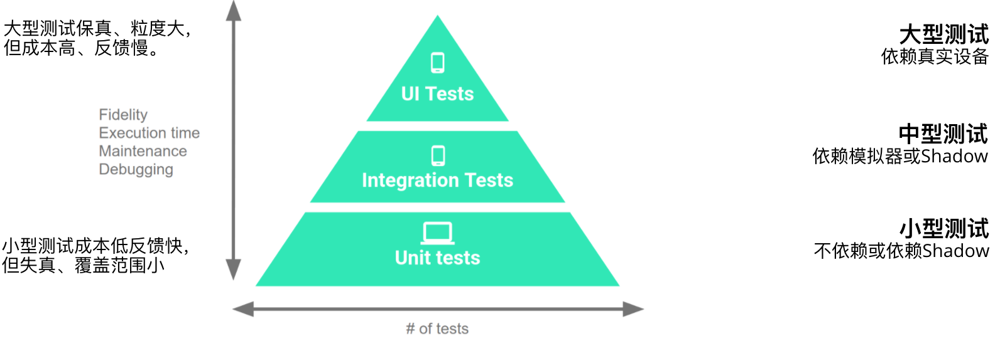
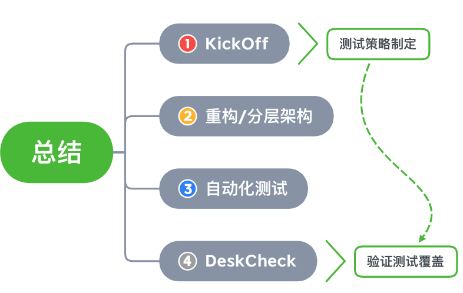

<!-- _class: invert -->

# <!--fit--> 遗留代码重构&测试

# 进阶篇：测试策略


CAC@OPPO by 黄俊彬 & 覃宇

---

目前的自动化测试有那些类型？
用什么样的工具？
有什么特点？

---

# 回顾：测试金字塔，是如何进行分层，有什么特点:question:

---

# 测试金字塔-Android

## 合理设计策略提高自动化测试的ROI



---

# Android自动化测试类型 ？？？


---

# 总结 

## 原则

不同的自动化测试(工具)有不同的适用场景，单靠一种测试不能完成自动化。要结合实际综合运用多种工具。

## 经验 

Google 根据自己 APK 开发团队的实践经验，采用测试驱动开发实践，推荐的小、中、大型测试的比例为：**7:2:1** :+1:

---

# 挑战

* 人员能力不足
* 难以覆盖全面
* 难以单元测试
* “影响开发进度”:question:

---

# 讨论：典型Android应用的分层测试，如何进行分层测试设计:question:

---

# MVP


---

 

## MVP优点

1. 复杂的逻辑处理放在presenter进行处理，减少了activity的臃肿。
2. M层与V层完全分离，修改V层不会影响M层，降低了耦合性。
3. 可以将一个Presenter用于多个视图，而不需要改变Presenter的逻辑。
4. P层与V层的交互是通过接口来进行的，便于单元测试。:+1:

## MVP缺点

1. 视图和Presenter的交互会过于频繁，有时需要定义大量的接口
2. Presenter 对 Activity 与 Fragment 的生命周期是无感知的
 
---

# 分层测试策略

### 小型测试

* Repository
* Presenter :heart:
* Model

### 中型测试

* Local data source

* Activity

### 大型测试

* ?

---

# MVVM


---

## MVVM优点

1. ViewModel：因设备配置改变导致 Activity 重建时，无需从 Model 中再次加载数据，减少了 IO 操作
2. LiveData：更新 UI 时，不用再关注生命周期问题
3. Data Binding：可以有效减少模板代码的编写，而且目前已经支持双向绑定

## MVVM缺点
1. 数据绑定使得Bug很难被调试
2. 数据双向绑定不利于代码重用，不能简单重用View

 
---

# 分层测试策略

### 小型测试

* Repository
* ViewModel :heart: (双向绑定，Databinding xml 不好测)，不用验证回调，验证数据)
* Model

### 中型测试

* Local data source
* service
* Activity

### 大型测试

?

---

# 如何选？
1. 对于偏向展示型的APP，绝大多数业务逻辑都在后端，app主要功能就是展示数据，交互等，建议使用MVVM。
2. 对于遗留的代码，使用MVP可以更低成本减低代码耦合度及提高可测试性

---

<!-- _class: invert -->

# <!--fit--> Demo

X项目组，开发新用户故事，使用MVP架构重构，并为Presenter新业务逻辑覆盖单元测试

 ---

 # 用户故事

 ## 动态服务更新后进入应用及时展示出来

 As a : 服务订阅用户
 I want: 有新的服务更新
 So that: 可以第一时间看到动态服务

 **AC1**: 在应用底部
 Given：用户已将列表收起或不存在服务信息
 When：有新的服务
 Then：将列表展示出来（堆叠状态）

// Other AC ...... 

 ---

 # 测试策略制定-KickOff

| 类型   | 内容                                                         | 负责人员  |
|--------|--------------------------------------------------------------|----------|
| 小型测试 | 1、识别判断服务是否更新                                          | 开发人员  |
| 中型测试 | 1、当列表收起时，有新服务，展示列表 <br> 2、当服务为空时，有新服务，展示列表 | 开发人员  |
| 大型测试 | 不覆盖（依赖服务推送数据）                                        | 测试工程师 |

### 当AC质量足够高时，按AC作为单元进行分析 :+1:

 
 ---

# 原实现逻辑及问题

``` 
class XView extend View{
    private void refreshXXXResult(){
        if(container==null||adapter==null){
            return;
        }
        mAdapter.setCardResults();
        int count=Helper.getAllSceneServiceCount();
        if(sceneCount<1){
            container.setVisibility(GONE);
            if(cardStatus.get()==XXX){
                //do something
            }
            if(cardStatus.get()==YYY){
               //do something
            }
        }else{
            if(serviceView.getVisibility()==GONE){
            // update view state
            }
        }
    }
}
```

* 在自定义View中实现了大部分的业务逻辑，编写新功能时对原有的代码改动大
* 新业务代码和View层耦合，测试编写难度大

---

# 重构实现

``` 
class XPresenter{

    XView xView;
    void queryData();
    //关键检查是否有新的服务更新
    public boolean checkIfHasNewServiceCards(){
        boolen hasNewCard=false;
        if(currentCount>lastCount){
            hasNewCard=true;
        }else if(!mLastSceneSet.containtsAll(mCurrentSceneSet)){
            hasNewServiceCards=true;
        }
        //do something ... ...
        return hasNewServiceCards;
    }
}
```

* 使用MVP模式定义对应的Presenter将业务逻辑与View层剥离（方法抽取、移动）
* 对新增业务方法checkIfHasNewServiceCards编写单元测试 
* XView直接依赖实现，没有按标准的接口定义 :-1:

---

# 单元测试

``` 
class XViewPresenterTest{
    var xPresenter:XPresenter
    var xView=mock(XView::class.java)
    var callBack=mock(CallBack::class.java)

    @Before
    fun setUp{
        xPresenter=XPresenter(xView,callBack)
    }

    @Test
    fun `should return true when checkIfHasNewServiceCards called if have new service cards with last set is empty` (){
        //Given
        val currentList=getElementsList()
        //when
        val result=presenter.checkIfHasNewServiceCards()
        //Then
        Assert.assertTrue(result)
    }

    @Test
    fun `should return false when checkIfHasNewServiceCards called if delete a dervice card` ()

     @Test
    fun `should return false when checkIfHasNewServiceCards called if service card do not change` ()

    // other test case ... ...
}
```

* 覆盖方法的条件分支
* mock隔离依赖view

---

# DeskCheck

* 展示测试的AC覆盖
* 展示测试的通过率

---

# 回顾



---

# 讨论：遗留系统中，并没有使用整洁架构，怎么办:question:

---

# 遗留系统测试策略

1. 补充核心功能的功能和集成测试，以保护核心功能不被破坏
2. 新功能需求，使用新的整洁架构进行设计及测试覆盖
3. 建立技术债偿还计划，逐优先级重构并补充核心功能的各级别自动化测试

---
 
 # 流程图

 ？

 # 时机

 1、加新功能需要改动原因的功能

 # 步骤

 1、新功能需要加上小型测试保障，覆盖核心业务逻辑
 2、如果调用到原有代码，使用安全重构，或者先加上中型测试

 # 原则

 提炼？
 

 

